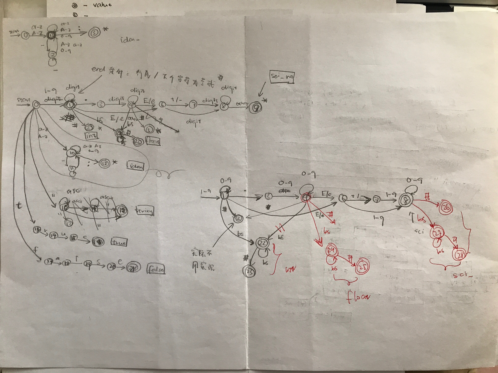
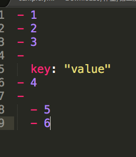
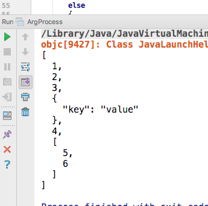
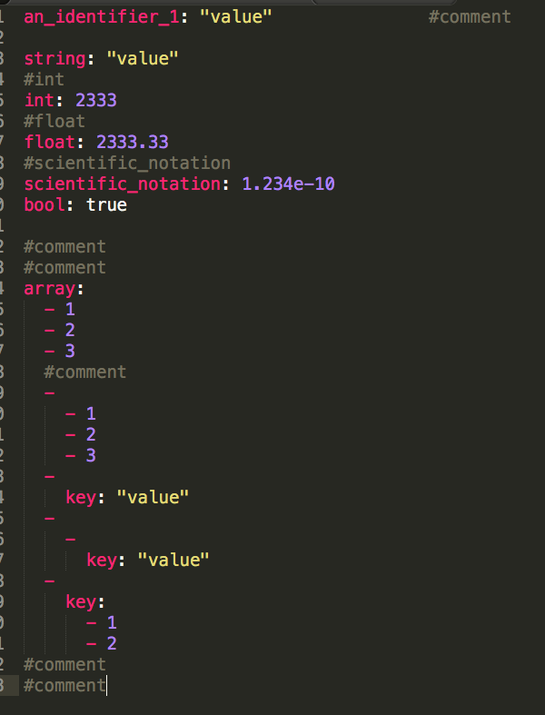
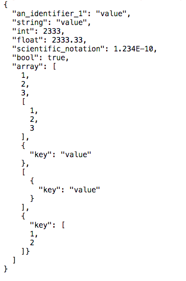
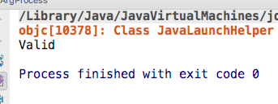
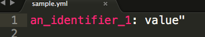
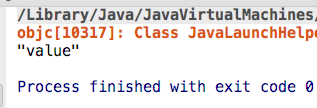
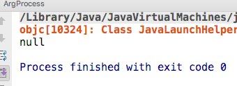

这次的yamlite解析器使用的是Java语言写成的，大体上可以分成四个部分：命令处理部分，代表yamlite中不同种类数据类型的实体类部分，yml文件处理部分，json文件生成部分和一个文件系统工具（fileutil类）

==它们的功能和实现如下：==

1. 命令处理部分：

利用了Java中的argprocess类来对命令行中的参数进行处理，通过对于参数的个数个特定位置上的参数的判断来对命令进行解析，然后调用相应的函数

2. 代表yamlite中不同种类的数据类型的实体类之间的关系可以归纳如下：

YmlItem类是其他类的超类，而且YmlItem为虚类，所以不能够自己产生对象。其子类为YmlArrayItem，YmlStringItem，YmlBoolItem，YmlFloatItem等，分别容纳不同的数据类型。其中YmlYmlItem类型可以容纳其他的YmlItem

3. yml文件处理部分：

首先对每一行进行分析，利用了如下图所示的自动机，在能够确定类型之后生成相应类型的YmlItem，然后再返回给jsonfile的content中。具体的函数调用为：首先在ArgProcess类中调用了isValid函数来验证yaml文件的语法是否符合规范，在isValid中 调用了processLine来解析出一行中的key与value，如果这一行是comment或者key value pair那么返回true，而且如果这一行是key value pair那么在调用getValue方法之后会返回一个ymlitem然后再放到jsonfile类中的content array list中。如果是最外层是array或者是数组，则会返回false，然后在processline中会根据返回的false来判断应该调用的函数。

对于数组的处理是这样的：用一个栈来存放所有层级的数组，stack的顶部存放的是当前数值应该存放的地方。如果后面一行的indentation小于前一行的，说明栈顶的数组中的值已经存放完了，所以应该把它弹出，放入当前栈顶的数组中。直到最外层的数组也存放完毕结束。

4. json文件生成类

在yml文件的处理中，已经把各种类型的ymlitem放到了JsonFile类的content中，所以如果要生成json文件，应该依次调用content中各个item的print()方法，并且需要一定的indentation来生成文件。

如果是要搜索，那么首先把搜索路径以符号'.'分段，然后再依次查找。

5. fileutil类

   通过对于输入的路径的判断，如果是yml文件则生成一个对应的lineNumberReader，否则报错。

==运行结果截图：==

1. 最外层为数组

2. 最外层为键值对：

   

   

   3. 验证／错误报告：

      

      

      

      

   4. 搜索功能：

      

      

      

      